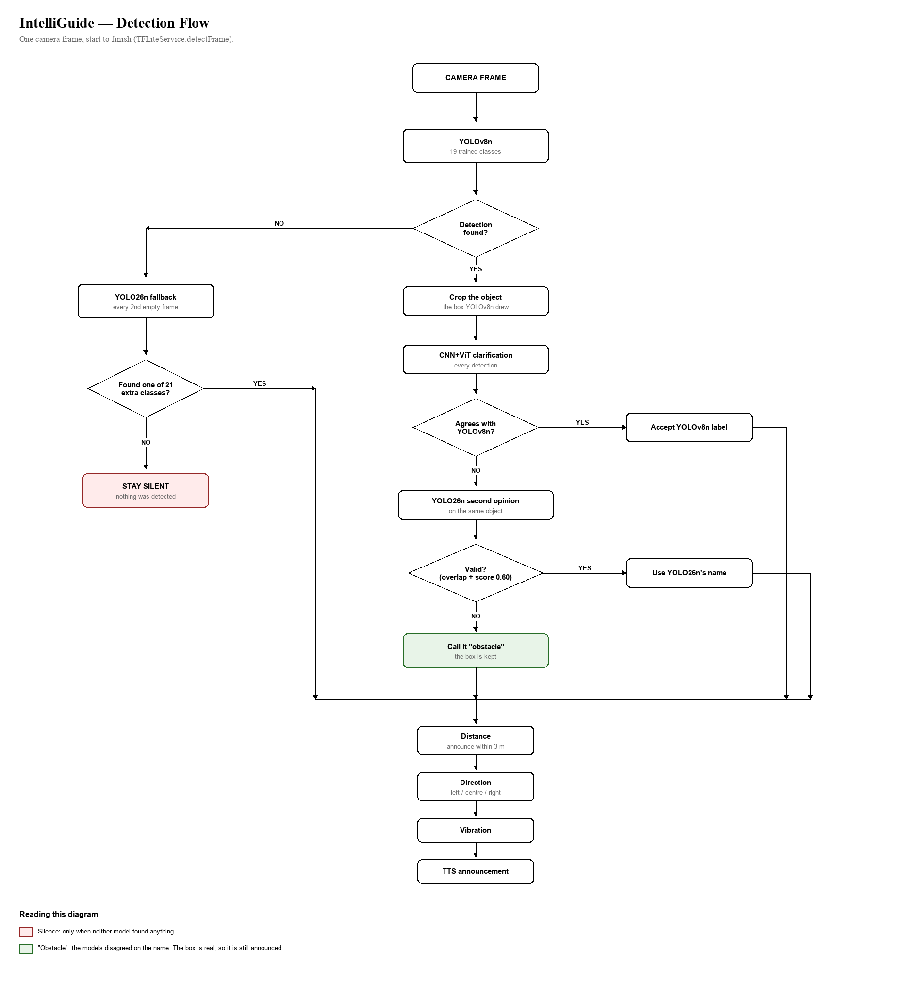

# IntelliGuide — architecture showcase

> **This repository shows the structure of IntelliGuide, not a working copy.**
> Every file, class, method signature and documentation comment from the app
> is here, but the method bodies have been replaced with
> `throw UnimplementedError(...)`, and the trained models and voice recordings
> are not included. It does not build into a working app.
>
> The full source code is kept private. Evaluators can request access from the
> author.

IntelliGuide is an Android app, built with Flutter, that helps blind and
visually impaired pedestrians. It watches the phone camera for obstacles, warns
by vibration and then by voice with the obstacle's distance and direction, and
can say where the user is. It was built for Naval, Biliran, Philippines, and
speaks English, Tagalog and Bisaya. Obstacle detection runs entirely on the
phone.

## Detection flow



1. The camera streams frames to **YOLOv8n**, trained on 19 obstacle classes.
2. When YOLOv8n detects something, the box is cropped and a **CNN+ViT**
   classifier checks the label.
   - It agrees: the YOLOv8n label is accepted.
   - It disagrees: **YOLO26n** (COCO) is asked about the same object. A
     confident, overlapping match supplies the name; otherwise the detection
     is announced as "obstacle".
3. When YOLOv8n detects nothing, YOLO26n is asked on every second empty frame.
   It covers 21 classes the dataset lacks, such as person, dog and bicycle.
4. The box height gives the distance and the box position gives the direction
   (left, centre or right).
5. An obstacle within 3 m, seen on two frames, is announced by vibration and
   then speech, at least 4 seconds apart.

The cascade is in `lib/services/tflite_service.dart` (`detectFrame`).

## Models

| Model | Role |
|---|---|
| YOLOv8n, 19 classes, 640 x 640 | Primary detector |
| CNN+ViT (ResNet18 + ViT-B/16), 19 classes, 224 x 224 | Label check |
| YOLO26n, COCO | Fallback and second opinion (21 of 80 classes used) |

From training: YOLOv8n reached mAP@50 0.874 and mAP@50-95 0.765; the CNN+ViT
reached 98.26% validation accuracy.

## Project layout

```
lib/
├── main.dart                        Entry point, language persistence
├── screens/
│   ├── language_screen.dart         Language picker (first launch)
│   ├── main_shell.dart              Bottom navigation
│   ├── camera_screen.dart           Detection loop, overlay, alerts, gestures
│   ├── map_screen.dart              Map, current position, saved landmarks
│   ├── history_screen.dart          Location history
│   └── settings_screen.dart         Language and saved places
└── services/
    ├── yolo_detector_service.dart   Frame preparation, YOLOv8n, box decoding
    ├── local_detector_service.dart  CNN+ViT classifier
    ├── coco_fallback_service.dart   YOLO26n
    ├── tflite_service.dart          The detection cascade
    ├── detection_confirmer.dart     Requires two sightings before an alert
    ├── distance_estimator.dart      Distance, direction, alert ordering
    ├── detection_log_service.dart   CSV log of detections, for diagnosis
    ├── camera_selector.dart         Chooses the camera
    ├── tts_service.dart             Recorded voice clips with TTS fallback
    ├── haptic_service.dart          Vibration patterns
    ├── location_service.dart        GPS fixes and their quality
    ├── barangay_service.dart        Barangay lookup from bundled boundaries
    ├── geocoding_service.dart       Nearby places and the spoken sentence
    ├── place_service.dart           Public and personal places
    ├── landmark_service.dart        Saved landmarks (Hive)
    ├── landmark_announcer.dart      Wording for saved places
    └── history_service.dart         Location history (Hive)
```

## Built with

Flutter and Dart; TensorFlow Lite (`tflite_flutter`) for on-device inference;
`camera`, `flutter_tts`, `audioplayers`, `vibration`, `geolocator`,
`geocoding`, `flutter_map`, `hive`. The full list is in `pubspec.yaml`.

## Known limitations

- YOLOv8n has no "unknown" class, so an object outside its 19 classes can be
  given the nearest-looking label. The CNN+ViT check and the YOLO26n second
  opinion reduce this but cannot remove it.
- Distance is estimated from one camera and an assumed real height per class,
  and the camera constant is not calibrated per phone.
- When a box runs off both the top and bottom of the frame, the distance
  cannot be measured, and the app reports "within 2.5 m" instead.
- Tested on one phone, a Samsung Galaxy A54.
